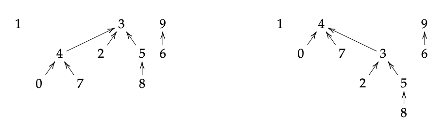

# CSE-103 Introduction to Algorithms 算法导入

## 📚 Professors
- [Damiano Mazza](https://lipn.univ-paris13.fr/~mazza/)

## 📚 Course Organization
- 7 lectures (1.5h) and 7 Tutorials (2h) 24.5 hours in total with 2 ECTS

## 📚 References of textbook
- T.H. Cormen, C.E. Leiserson, R.L. Rivest and C. Stein. Introduction to Algorithms. The MIT Press, 2009.
- D. E. Knuth. The Art of Computer Programming, Vol. 3: Sorting and Searching. Addison Wesley, 1998.

## 📚 Course Arrangement
- [x] LEC 0: Introduction to Algorithms
- [x] LEC 1: Divide and Conquer, Sorting and Searching
- [x] LEC 2: Complexity Analysis 1
- [x] LEC 3: Complexity Analysis 2
- [x] LEC 4: Correctness of Algorithms
- [x] LEC 5: Dynamic Programming and Greedy Algorithms
- [x] LEC 6: Graph Algorithms

Graph Algorithms:

## Tools of this course
Python, mathematical analysis

## Copyright
Copyright by Maxime Breden, Yubo Cai, Ecole Polytechnique
